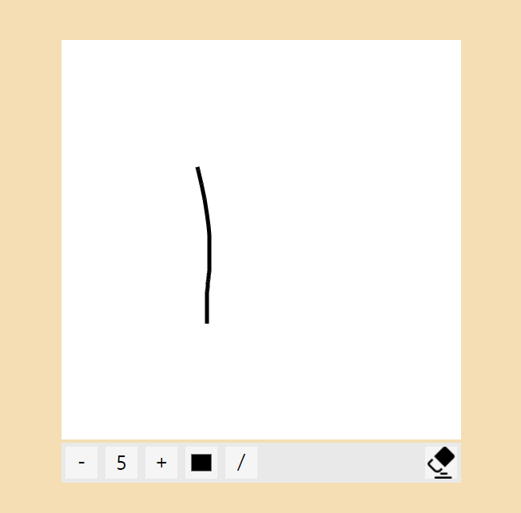
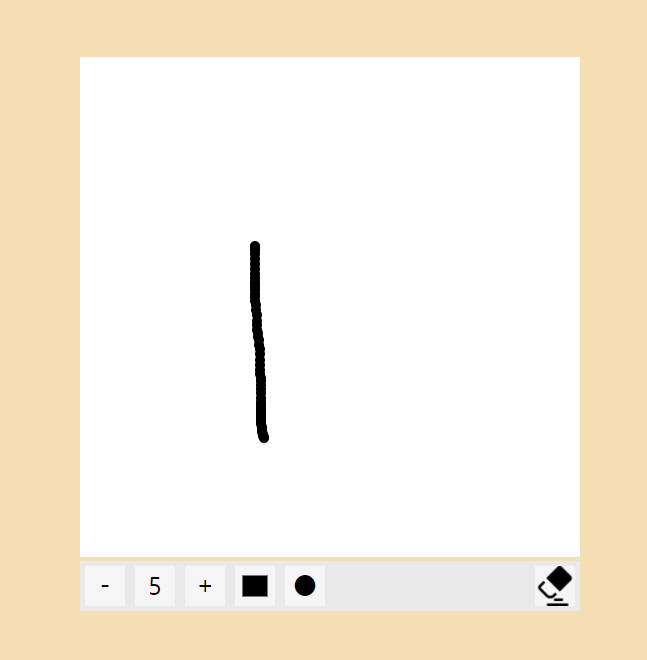
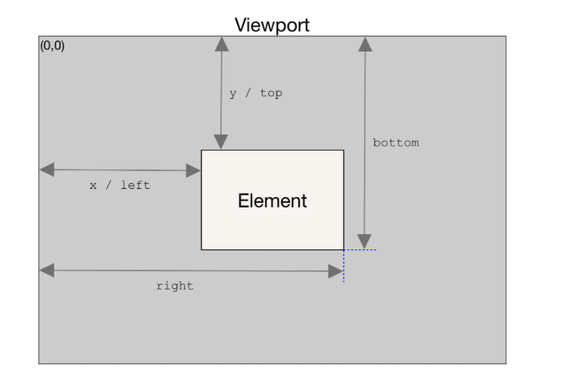

# Drawing Canvas
그림을 그리는 방법에는 원을 이어붙여 그리는 방법과, 선을 따라그리는 방식 두가지로 나누었습니다. 아래 왼쪽에서 5번째 버튼을 클릭하면 전환됩니다.   

  
   
<br>
<br>

## DOMrect
캔버스 안에서의 왼쪽 위 가장자리 clienX,Y값을 0,0으로 설정하기 위해 다음과 같은 코드를 사용하였습니다.  
```js
function getCursorPosition(a, event) {
    const rect = a.getBoundingClientRect()
    const x = event.clientX - rect.left
    const y = event.clientY - rect.top

    return [x,y]
}
```
위에서 사용된 getBoundingClientRect()는 DOMrect(각종 좌표값들이 들어있는 객체)를 가져오는 것인데, 이를 가져와 html문서상의 0,0위치부터 canvas그림판의 x,y값(`rect.left`,`rect.top`)을 빼줌으로, canvas의 왼쪽 위 가장자리를 0,0으로 만들어 줬습니다.  
   
위 그림은 DOMrect에 대한 설명입니다.  
<br>

## Circle Draw
위에서 가져온 커서 위치에 원을 그려주는 것을 반복하여 그림이 이어지도록 하였습니다.  
`mousedown`이벤트 안에 `mousemove`이벤트를 넣어, 누르고 있을 때는 계속해서 그림을 그리도록 하였고, `mouseup`이벤트에 `mousemove`이벤트를 삭제해주면서, 마우스를 누르지 않을 때는 그림을 그리지 않도록 설정하였습니다.  
```js
const canvas = document.querySelector('canvas')
const ctx=canvas.getContext('2d')
canvas.addEventListener('mousedown',()=>{
    function moveEvent(e){
        const x=getCursorPosition(canvas, e)[0]
        const y=getCursorPosition(canvas, e)[1]
        ctx.beginPath();
        ctx.arc(x, y, size, 0, Math.PI * 2, true) //원의 크기 조절
        ctx.fill(); //원을 채움
    }
    canvas.addEventListener('mousemove', moveEvent)
    canvas.addEventListener('mouseup',function remove(){
        canvas.removeEventListener('mousemove',moveEvent)
        this.removeEventListener('mouseup',remove)
    })
})
```   
<br>

## Line Draw
처음 누른 곳의 좌표를 저장해 저장한 좌표와 다음 누른 곳의 좌표를 이어 선을 긋는 방식으로 코드를 작성하였습니다. 

```js
let i=0
let x1=0
let y1=0
function lineHandler(){
    ctx.strokeStyle = drawingColor
    ctx.lineWidth=sizeNumber
    function moveEvent(e){
        const x=getCursorPosition(canvas, e)[0]
        const y=getCursorPosition(canvas, e)[1]
        ctx.beginPath();
        ctx.moveTo(x, y);
        if(i===1){
            ctx.lineTo(x1, y1);
        }
        x1=x
        y1=y
        i=1
        ctx.stroke();
    }
    canvas.addEventListener('mousemove', moveEvent)
    canvas.addEventListener('mouseup',function remove(){
        canvas.removeEventListener('mousemove',moveEvent)
        this.removeEventListener('mouseup',remove)
        i=0
    })
}
```