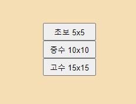
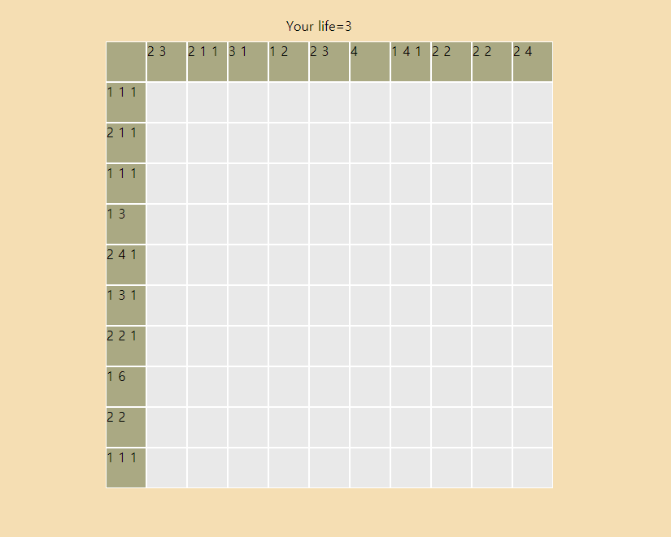

# Summary
* <a href="README.md">Introduction</a>
* <a href="nonogram.md">Nonogram</a>  
 

## Nonogram
I am a beginner.:blush:  
Doing it for practice.:smiley:  
Please give me a lot of feedbacks.:grin:  
I made this game by myself.     
 

## Completion

   

좌측은 난이도를 선택할 수 잇는 버튼들이고, 버튼을 선택하면 우측에 보이는 이미지처럼 게임이 실행됩니다. 마우스 왼쪽 버튼을 누르면, 확인할 수 있고, 오른쪽 버튼을 누르면 X표시로 체크해놓을 수 있으며 한 번 더 누르면 원상태로 복구됩니다.