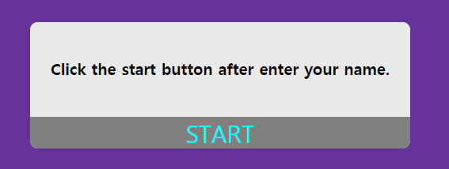
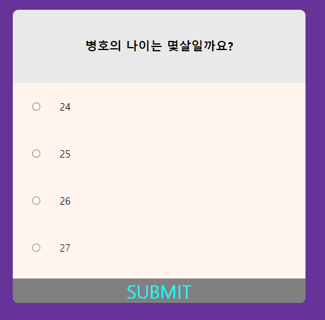

# @keyframes
이름을 입력 후 start버튼을 눌렀을 때, 공간이 확장되는 효과를`css`의 `@keyframe`을 사용함으로써 부드럽게 적용되도록 했습니다.  



```css
@keyframes expand{
    0%{
        height: 160px;
    }
    100%{
        height: 480px;
    }
}

@keyframes fadeIn{
    0%{
        opacity: 0;
    }
    100%{
        opacity: 1;
    }
}

@keyframes fadeOut{
    0%{
        opacity: 1;
    }
    100%{
        opacity: 0;
    }
}
```
위는 `css`이며 아래는 `javascript` code입니다.

```js
function start(){
    starting.addEventListener("click",()=>{
        if(localStorage.getItem('name')){
            space.style.animation="expand 2s"
            space.style.height="480px"
            problem.style.animation="fadeOut 1s"
            submit.style.display="block"
            starting.style.display="none"
            setTimeout(()=>{
                problem.style.animation="fadeIn 1s"
                problem.textContent=problems[0].question
            },900)
            setTimeout(()=>{
                first.style.animation="fadeIn 1s"
            },400)
            setTimeout(()=>{
                second.style.animation="fadeIn 1s"
            },800)
            setTimeout(()=>{
                third.style.animation="fadeIn 1s"
                first.style.opacity="1"
            },1200)
            setTimeout(()=>{
                fourth.style.animation="fadeIn 1s"
                second.style.opacity="1"
            },1600)
            setTimeout(()=>{
                third.style.opacity="1"
            },2000)
            setTimeout(()=>{
                fourth.style.opacity="1"
            },2400)
        }else{
            alert("Please enter your name before start")
        }
    }
}
```
START버튼을 눌렀을때, name의 value값이 존재한다면, 가운데 공간에 `expand`라는 이름의 `@keyframe`을 적용해주고, 원래있던 text에 `fadeOut`이라는 `@keyframe`을 적용하여, 부드러운 효과를 냈습니다. 또한 문제들의 보기는 총 4개인데 `expand`효과가 2초동안 적용되는 동안에 위에서부터 보기가 차례대로 보이도록 설정했습니다.