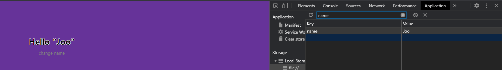

# Name
여기서 name은 `localStorage`에 집어넣어, 창이 바뀌어도 name이 유지되게 만들었습니다.  
  
<br>

## addName
`addEventListner`기능을 통해 아래 이지미에 V라고 써있는 버튼을 누르게되면 `input`창의 `value`값을 받아, `backtic(``)`을 이용해 `hello "${store}"`이라고 출력되게 설정하였다. 또한 이를 localStorage에 저장하였다. 아래에 주석을 달아놓은 부분은, 위가 실행되었을 때 이름이 뜨는 공간을설정한 것이다.


```js
const hello=document.querySelector("#first").querySelector("h2")
const name=document.querySelector("#name")
function buttonClick(){
    button.addEventListener("click",()=>{
        if(name.value){
            let store=name.value
            hello.textContent=`Hello "${store}"`
            localStorage.setItem('name',store)
            name.style.display="none" //
            button.style.display="none" //
            change.style.display="block" //
            hello.style.display="block" //
        }else{
            alert("Please enter your name")
        }
    })
}
```
<br>

## loadName
등록된 name이 있을 경우 위와 name값 등록과 같은 과정을 반복해, name을 치는 순서를 배제했습니다. 없을 경우에는 아래와 같이, 이름을 치는 공간이 모니터에 표시되게 설정했습니다.
```js
function loadName(){
    if(localStorage.getItem('name')!==null){
       let store=localStorage.getItem('name')
       name.style.display="none"
       button.style.display="none"
       hello.textContent=`Hello "${store}"`
       change.style.display="block"
    } else if(localStorage.getItem('name')===null){
        name.style.display="block"
        button.style.display="block"
    }
}
```