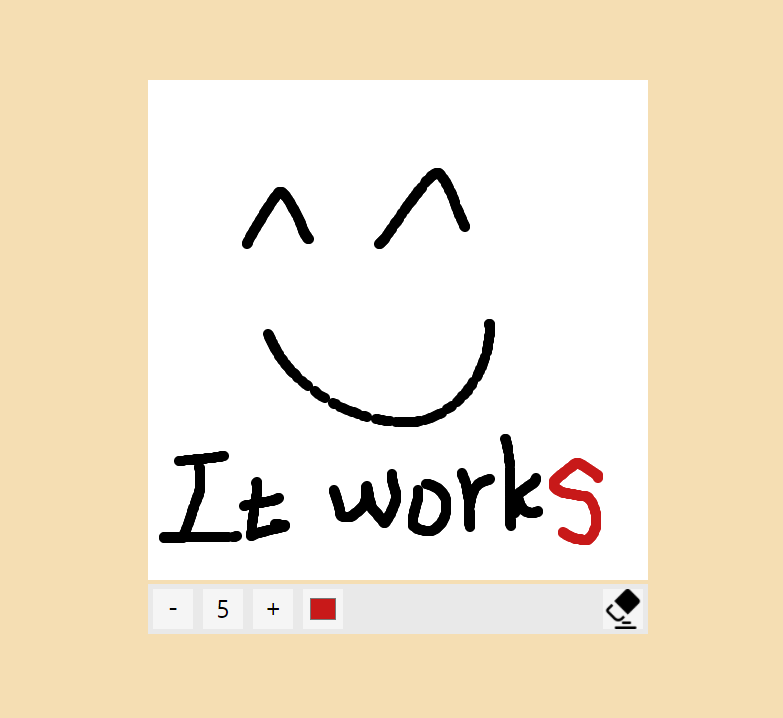

# Github-Profile-Searching-App
I am a beginner.😊 
Doing it for practice.😃 
Please give me a lot of feedbacks.😁 
This app will help you to search github users.  
 

## Completion
There is `div` element which shows a result from input value.
