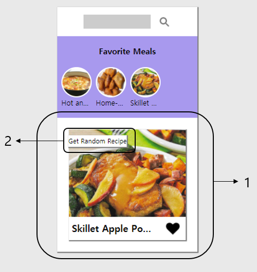

# Meal Information
아래 이미지의 1번태그 안의 그림 혹은 이름이 쓰여져 있는 부분을 누르면 해당 음식의 상세페이지로 연결되도록 설정해놓았습니다.  
또한 2번의 Get Random Recipe를 클릭하면 다른 음식이 뜨도록 설정하였습니다.  
  
<br>

## Get Random Recipe
해당 버튼을 클릭하면 `getRandomMeal()`을 통해 새로운 음식이 생성되고, 그 음식의 정보들을 2번의 공간에 담도록 설정하였습니다. 또한 `event.stopPropagation()`을 통해 상위 항목의 클릭 이벤트가 중첩되지 않도록 설정하였습니다.  
랜덤으로 가져오는 음식의 ID가 이미 Favorite Meals에 있는 항목일 경우에 아래코드를 추가하여, 중복을 방지하였습니다.
```js
for(let v=0; v<mealsList.length;v++){
    if(randomMeal.idMeal===mealsList[v].id){
        heart.style.backgroundImage='url("./images/heart1.png")'
        heart.setAttribute('id','styled')
        heartNum=1
    }
}
```
아래는 코드 전문입니다.

```js
async function getRandomMeal(){
    const resp = await fetch("https://www.themealdb.com/api/json/v1/1/random.php")
    const respData = await resp.json()
    const randomMeal= respData.meals[0]
    image.style.backgroundImage=`url(${randomMeal.strMealThumb})`
    imageName.textContent=randomMeal.strMeal
    
    if(randomMeal.strSource){
        image.setAttribute('onclick',`window.open("${randomMeal.strSource}")`)
        imageName.setAttribute('onclick',`window.open("${randomMeal.strSource}")`)
    }else{
        image.setAttribute('onclick',`alert("I'm sorry, there is no linked website")`)
        imageName.setAttribute('onclick',`alert("I'm sorry, there is no linked website")`)
    }
    heart.style.backgroundImage="url(./images/heart.png)"
    heartNum=0
    for(let v=0; v<mealsList.length;v++){
        if(randomMeal.idMeal===mealsList[v].id){
            heart.style.backgroundImage='url("./images/heart1.png")'
            heart.setAttribute('id','styled')
            heartNum=1
        }
    }
}
```
```js
function clickRandom(){
    document.querySelector("#inside").addEventListener("click",function(event){
        getRandomMeal()
        event.stopPropagation()
    })
}
```