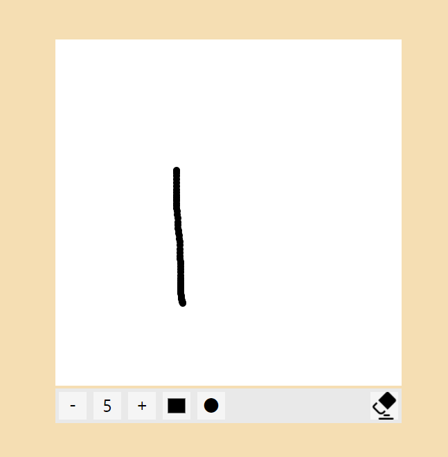

# Alarm
아래 이미지의 빨간색펜으로 표시된 +버튼을 누르면 `div`엘리먼트를 두 개 생성해 하나는 배경에 검을 색 바탕을 주고 `opacity`로 투명도를 조절해 어둡게 보이는 효과를 구현했으며, 다른 태그에는 알람시간을 설정할 수 있는 공간을 만들었습니다.  
  
<br>

## Add Alarm
알람을 설정할 때 년,월,일,시,분,메모 위 `input`들을 한 `form`안에 넣어 한 번에 `submit`할 수 있도록 설정하였습니다.  
알람을 설정할 때 아래와 같은 코드를 추가하여 현재 시간보다 이전에 시간으로 알람을 설정할 수 없게 만들어 놓았습니다.
```js
const date=new Date()
const year=date.getFullYear()
const month=date.getMonth()+1
const day=date.getDate()
const hours=date.getHours()
const minutes=date.getMinutes()
form.addEventListener('submit',(e)=>{
    if(Number(yearInput.value+
        `${monthInput.value < 10 ? `0${monthInput.value}` : monthInput.value}`+
        `${dayInput.value < 10 ? `0${dayInput.value}` : dayInput.value}`+
        `${hoursInput.value < 10 ? `0${hoursInput.value}` : hoursInput.value}`+
        `${minutesInput.value < 10 ? `0${minutesInput.value}` : minutesInput.value}`)
        <=
        Number(yearInput.value+
        `${month < 10 ? `0${month}` : month}`+
        `${day < 10 ? `0${day}` : day}`+
        `${hours < 10 ? `0${hours}` : hours}`+
        `${minutes < 10 ? `0${minutes}` : minutes}`)){
            alert('현재 시간이나 지나간 시간을 알람으로 설정할 수 없습니다.')
            e.preventDefault()
    }
```  
<br>

## Active Alarm
<br>
알람을 추가한 모습은 위 이미지와 같으며, 추가함과 동시에 `localStorage`에 저장되도록 설정해놓았습니다.

```js
setInterval(()=>{
    for(let i=0;i<alarmList.length;i++){
        if(date.getFullYear()===Number(alarmList[i].year.substr(0,alarmList[i].year.length-1))){
            if(date.getMonth()+1===Number(alarmList[i].month.substr(0,alarmList[i].month.length-1))){
                if(date.getDate()===Number(alarmList[i].day.substr(0,alarmList[i].day.length-1))){
                    if(date.getHours()===Number(alarmList[i].hours.substr(0,alarmList[i].hours.length-1))){
                        if(date.getMinutes()===Number(alarmList[i].minutes.substr(0,alarmList[i].minutes.length-1))){
                            //Audio play
                    }
                }
            }
        }
    }
),1000)
```
현재 시간과 리스트에 있는 시간들을 1000ms마다 비교하여, 시간이 일치될 때 설정해 놓은 audio 파일을 재생하도록 구성하였습니다.