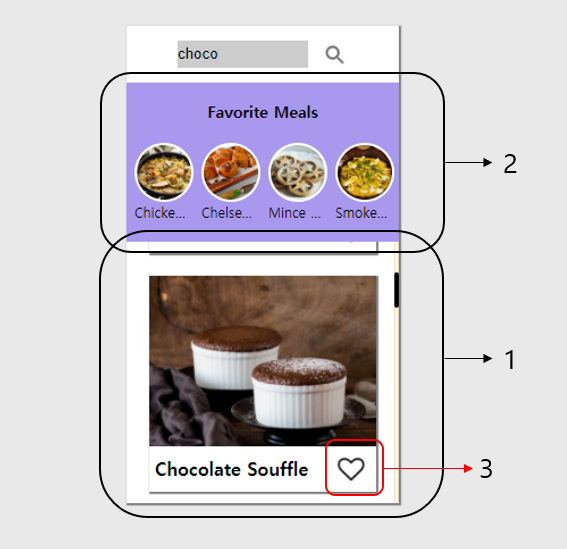

# Liked meal
Favorite Meals에는 3번의 하트를 누르면 1번의 음식이 2번의 공간에 생성되도록 설정하였습니다.  
  
<br>

## Save Favorite
하트 버튼을 누르면 2번의 공간에 `html`의 `li`태그가 생성되며, 몇가지 정보들을 배열에 저장함과 동시에 불러오기 위해, 이를 `localStorage`에 저장하는 과정으로 만들었습니다.
아래는 코드입니다. 여기서 `randmomMeal`은 앞서 <a href="api.md">Using Meal API with async/await</a>에서 소개한 `getRandomMeal()`의 `return`값입니다.  
`localStorage`에는 오브젝트값이 들어가지 못하기때문에, `JSON.stringify()`를 통해 문자열로 바꿔 저장했습니다.
```js
let heartNum=0
let mealsList=[]
function heartClick(){
    heart.addEventListener("click",()=>{
        if(heartNum===0){
            heart.style.backgroundImage="url(./images/heart1.png)"
            const li=document.createElement('li')
            const div=document.createElement('div')
            const span=document.createElement('span')
            li.id=randomMeal.idMeal
            div.style.backgroundImage=`url(${randomMeal.strMealThumb})`
            span.textContent=randomMeal.strMeal
            li.appendChild(div)
            li.appendChild(span)
            ul.appendChild(li)
            heartNum++
            meals={
                id:randomMeal.idMeal,
                name:randomMeal.strMeal,
                heartNum:heartNum,
                backgroundImage:`url(${randomMeal.strMealThumb})`
            }
            mealsList.push(meals)
            localStorage.setItem('meals',JSON.stringify(mealsList))
        }
        else if(heartNum===1){
            heart.style.backgroundImage="url(./images/heart.png)"
            heartNum--
            const parent=document.getElementById("mid-low")
            const child=document.getElementById(randomMeal.idMeal)
            parent.removeChild(child)
            const cleanList=mealsList.filter(function(List){
                return List.id!==randomMeal.idMeal
            })
            mealsList=cleanList
            localStorage.setItem('meals',JSON.stringify(mealsList))
        }
        liClick() //아래 View Details에서 다루겠습니다.
    })
}
```  
<br>

## Load Favorite
`localStorage`에 저장한 값들을 불러와 `for.. in`문을 사용해 개수만큼 `li`태그를 만드는 과정을 거쳤습니다.  
이때 localStorage의 값들을 `JSON.parse()`를 통해 바꿔 불러내었습니다.

```js
function loadMeals(){
    const meals=localStorage.getItem('meals')
    if(meals!==null){
        parsedMeals=JSON.parse(meals)
        mealsList=parsedMeals
        for(i in parsedMeals){
            const li=document.createElement('li')
            const div=document.createElement('div')
            const span=document.createElement('span')
            li.id=mealsList[i].id
            div.style.backgroundImage=mealsList[i].backgroundImage
            span.textContent=mealsList[i].name
            li.appendChild(div)
            li.appendChild(span)
            ul.appendChild(li)
            mealsList[i].heartNum=1
            localStorage.setItem('meals',JSON.stringify(mealsList))
        }
    }
}
```  
<br>

## View Details
만들어진 Favorite Meals 내의 항목은, 클릭하면, 1번의 공간에 다시 뜨도록 표시했습니다.  
이는 위의 Save Favorite에서 `li`태그를 만드는 것이 끝나면, 아래의 함수가 실행되도록 하기위해 `liclick()`은 저 위치에 놓았습니다. 
```js
function liClick(){
    const clickList=document.querySelectorAll('li')
    for(let i=0;i<clickList.length;i++){
        clickList[i].addEventListener("click",async(e)=>{
            const meal= await getMealbyId(e.target.parentNode.id)
            image.style.backgroundImage=`url(${meal.strMealThumb})`
            imageName.textContent=meal.strMeal
            heart.style.backgroundImage="url(./images/heart1.png)"
            image.setAttribute('name',meal.idMeal)
            image.setAttribute('id',meal.strMealThumb)
            heartNum=3
            if(meal.strSource){
                image.setAttribute('onclick',`window.open("${meal.strSource}")`)
                imageName.setAttribute('onclick',`window.open("${meal.strSource}")`)
            }else{
                image.setAttribute('onclick',`alert("I'm sorry, there is no linked website")`)
                imageName.setAttribute('onclick',`alert("I'm sorry, there is no linked website")`)
            }
        })
    }
```