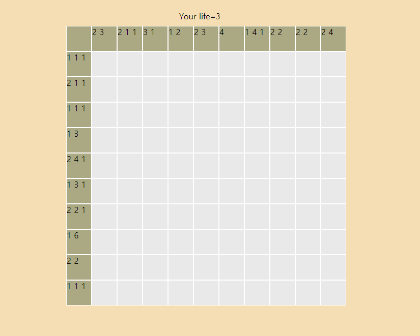

# NONOGRAM


난이도는 초보, 중수, 고수로 나뉘었으며 각각 5X5, 10X10, 15X15칸의 게임을 진행하도록 설정하였습니다.  
<br>

## Create Space
  

각각의 버튼을 누르면 원하는 크기 만큼의 `div`태그들이 생성되며 전부 `css`의 `float:left`기능을 사용하여, 위에서부터 쌓아지도록 만들었습니다.
```js
for(let i=0;i<(n+1)*(n+1);i++){
    if(i<(n+1)||i%(n+1)===0){
        block.setAttribute('class','numbers')
        block.id=v
        v++
    }
}
```
위와 같은 코드를 넣어 각각의 1행과 1열은, 해당하는 행과 열에 몇 개의 검정색 블록이 있는지 체크하는 공간으로 만들었습니다.
```js
const nonogram=[]
for(let i=0;i<(n+1)*(n+1);i++){
    if(){

    }else{
        let random=Math.floor(Math.random()*2)
        if(random===0){
            block.setAttribute('class','black')
            random='black'
            blackCount++
        }else{
            block.setAttribute('class','white')
            random='white'
        }

        if(columnIndex<(n+1)){
            let nonoIndex=[rowIndex,columnIndex,random]
            nonogram.push(nonoIndex)
            columnIndex++
        }else{
            rowIndex++
            columnIndex=1
            let nonoIndex=[rowIndex,columnIndex,random]
            nonogram.push(nonoIndex)
            columnIndex++
        }
    }
}
```
위의 코드는 `Math.random`을 통해, 0인 곳은 검정색블록, 1인 곳은 흰색블록으로 설정되게 하였으며, 나중에 사용하기 위해 그 위치의 행과 열을 `rowIndex`와 `columnIndex`로 저장하여 놓았습니다.  
<br>

## Create row and cloumn
앞에 만들어 놓은 nonogramList를 `for`문을 이용하여, 그 행에, 그 열에 몇 개의 검정색 블록이 있는지 확인하고 이를 숫자로 표현하도록 하였습니다.  
중간에 흰블록이 껴있으면 다시 1부터 세도록 하였습니다.
```js
let blackWhite=[]
for(let j=1;j<(n+1);j++){
    for(let i=0;i<n*n;i++){
        if(nonogram[i][0]===j){
            if(nonogram[i][2]==='black'){
                blackWhite.push('1')
            }else{
                blackWhite.push('0')
            }
        }
    }
    let test= document.getElementById(`${j+n}`)
    test.textContent=blackWhite
    blackWhite=[]
} // column

for(let j=1;j<(n+1);j++){
    for(let i=0;i<n*n;i++){
        if(nonogram[i][1]===j){
            if(nonogram[i][2]==='black'){
                blackWhite.push('1')
            }else{
                blackWhite.push('0')
            }
        }
    }
    let test= document.getElementById(`${j}`)
    test.textContent=blackWhite
    blackWhite=[]
} //row
```  
<br>

## Create click event
왼쪽클릭을 하면, 검정색 칸인지 흰색칸인지 확인을 하며, 흰색칸일 경우 life가 1줄어들게 하여 0이 되면 게임이 탈락되도록 하였습니다. 또한 검정색칸의 개수를 count하여, 총 오픈한 검정 칸이 blackCount함수와 일치하면 게임을 승리하도록 설정하였습니다.  
오른쪽 클릭을 하면, X표시로 체크해 놓을 수 있는 기능을 추가해였습니다.

```js
document.querySelectorAll('.white').forEach(function(element){
    function left(e){
        if(!e.target.style.backgroundImage){
            life--
            lifeDiv.textContent=`Your life=${life}`
            e.target.style.backgroundImage='url(./images/redX.png)'
            e.target.removeEventListener('contextmenu',right)
        }else if(e.target.style.backgroundImage==='url("./images/X.png")'){
            life--
            lifeDiv.textContent=`Your life=${life}`
            e.target.style.backgroundImage='url(./images/redX.png)'
            e.target.removeEventListener('contextmenu',right)
        }
            
        if(life===0){
            setTimeout(()=>{
                alert('남은 목숨이 없습니다. 다시시작하십시오.')
                whole.removeChild(div)
                chobo.style.display='inline-block'
                normal.style.display='inline-block'
                gosu.style.display='inline-block'
                lifeDiv.textContent=''
                whole.style.width='90px'
                whole.style.height='90px'
                whole.style.margin='400px auto'
            },1000)
        }
    }
    function right(e){
        e.preventDefault()
        if(!e.target.style.backgroundImage){
            e.target.style.backgroundImage='url(./images/X.png)'
        }else{
            e.target.style.backgroundImage=''
        }
    }
    element.addEventListener('click',left)
    element.addEventListener('contextmenu',right)
})
```
위 코드는 흰색칸을 왼쪽클릭, 오른쪽 클릭했을 때의 코드입니다.

```js
document.querySelectorAll('.black').forEach(function(element){
    function left(e){
        e.target.style.backgroundColor='black'
        e.target.style.backgroundImage=''
        e.target.removeEventListener('contextmenu',right)
        blackCount--
        if(blackCount===0){
            setTimeout(()=>{
                alert('승리하셨습니다.')
                whole.removeChild(div)
                chobo.style.display='inline-block'
                normal.style.display='inline-block'
                gosu.style.display='inline-block'
                lifeDiv.textContent=''
                whole.style.width='90px'
                whole.style.height='90px'
                whole.style.margin='400px auto'
            },1000)
        }
    }
    
    function right(e){
        e.preventDefault()
        if(!e.target.style.backgroundImage){
            e.target.style.backgroundImage='url(./images/X.png)'
        }else{
            e.target.style.backgroundImage=''
        }
    }

    element.addEventListener('click',left)
    element.addEventListener('contextmenu',right)
})
```
위 코드는 검정칸을 왼쪽클릭, 오른쪽 클릭했을 때의 코드입니다.