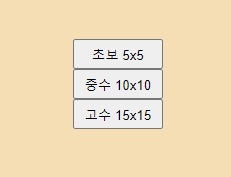
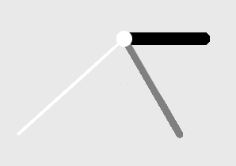

# Seaching Meal
검색하고 싶은 음식의 이름이나 부분을 1번의 `input`창에 입력하고 돋보기버튼을`click`하면 그에 대한 결괏값은 2번으로 표시된 부분에 표시됩니다.  
결괏값이 많다면, `css`의`scroll:auto`를 사용하여 스크롤을 자동으로 만들게 하였고, 결괏값이 없을 경우 오른쪽 이미지와 같이 `alert`가 뜨도록 표시했습니다.   

  
<br>

## Result
돋보기 버튼을 눌렀을 때, 앞서 `Using Meal API with async/await`에서 소개한 `getMealsBySearch`함수를 통해 `input.value`값에 해당하는 배열을 `meals`로 불러온다.  
이때 `await`기능이 사용되는데 이를 위해서는 `async`가 필요하다. 이는 다음과 같이 들어갈 수 있다.
```js
searchButton.addEventListener("click",async(e)=>{
    const meals=await getMealsBySearch(input.value)
```
값을 불러온 후 `input`값이 있으면 다음으로 넘어가고 `getMealsBySearch`값이 있으면 또 다음으로 넘어간다.  
그 이후에는 그 전에 있던 결과들을 다음과 같이 `hasChildNodes`를 통해 다 삭제하고,
```js
while(result.hasChildNodes()){
    result.removeChild(result.firstChild)
```
 배열의 값 하나하나에 해당하는 `html`의 `li`를 추가해 값을 넣는다.  
 아래는 이러한 코드들의 전문이다.

```js
const input=document.querySelector("#input")
const searchButton=document.querySelector("#button")
function search(){
    searchButton.addEventListener("click",async(e)=>{
        const meals=await getMealsBySearch(input.value)
        if(!input.value){
            alert("Please enter something")
        }else{
            if(meals===null){
                alert("There is no result")
            }else{
                const result=document.querySelector("#search-result")
                document.querySelector("#first").style.display="none"
                while(result.hasChildNodes()){
                    result.removeChild(result.firstChild)
                }
                for(let i=0;i<meals.length;i++){
                    //2번에 표시될 meals.length만큼의 space를 만드는 codes
                    //codes that make space which is shown in No.2 as much meals.length
                    //makeSpace()
                }
            }
        }
    }
}
```
<br>

## Make Heart
결괏값이 생성된 이미지는 다음과 같은데, 여기서 3번의 하트버튼을 누르면 표시된 1번의 음식이 2번의 Favorite Meals로 들어가는 것입니다.  
  
생성되는 모든 하트 `class`에 기능을 넣기 위해서 `Array.from().forEach()`를 사용하였다.
빈 하트일 때 클릭을 하면 `e.target`을 사용하여 그 타겟을 설정했고 `setAttribute`를 통해 id을 생성하게 하며, 꽉찬 하트로 바뀌게 했습니다.  
꽉찬 하트일 때는 그 타겟의 id를 삭제하며 빈 하트로 바뀌게 했습니다.  
빈하트인지 아닌지는 타겟의 id가 있는지 없는지를 통해 구분했습니다.


```js        
Array.from(hearts).forEach(function(like){
    like.addEventListener('click',async(e)=>{
        const meal= await getMealbyId(e.target.parentNode.parentNode.id)
        if(e.target.id){
            like.style.backgroundImage="url(./images/heart.png)"
            e.target.removeAttribute('id')
            //Some codes which remove the list have been excluded
        }else{
            like.style.backgroundImage="url(./images/heart1.png)"
            e.target.setAttribute('id','styled')
            //Some codes which make the list have been excluded
        }
    })
}
```